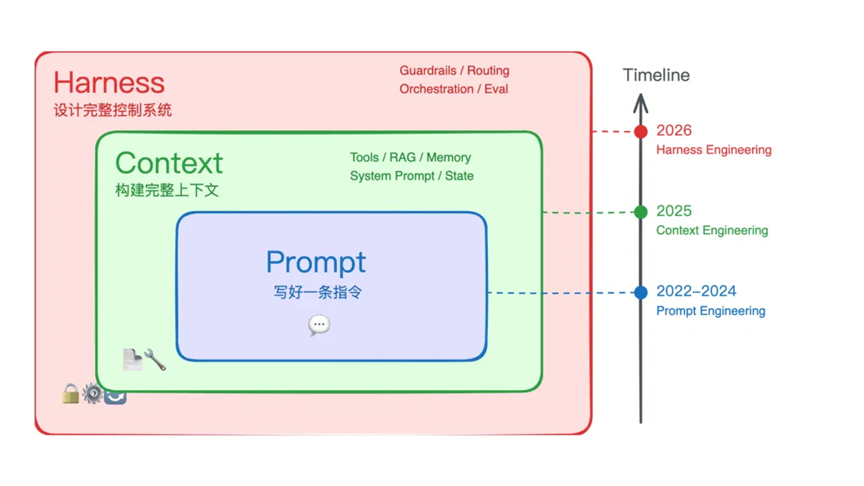
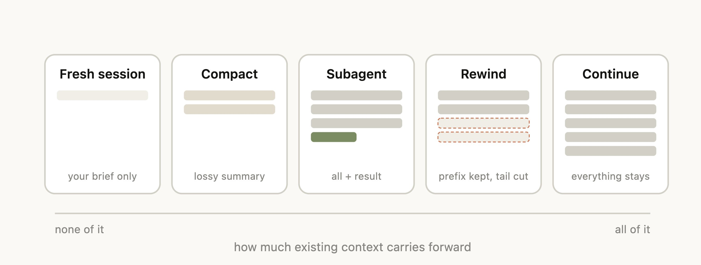
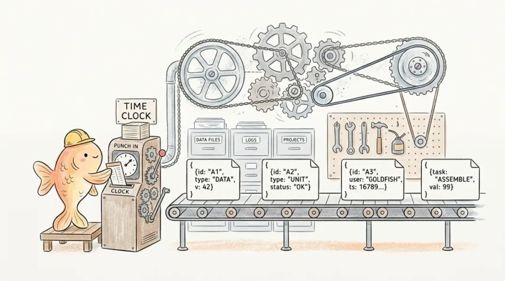
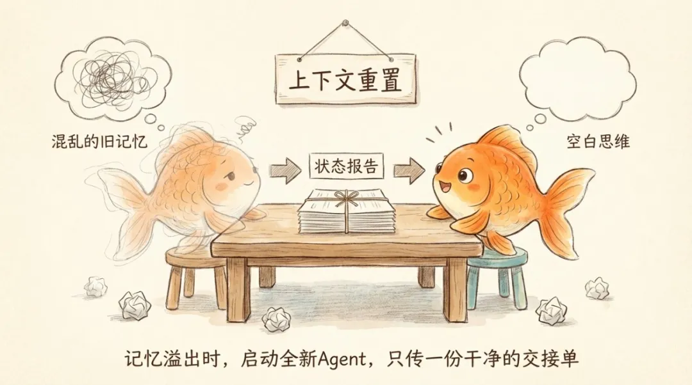
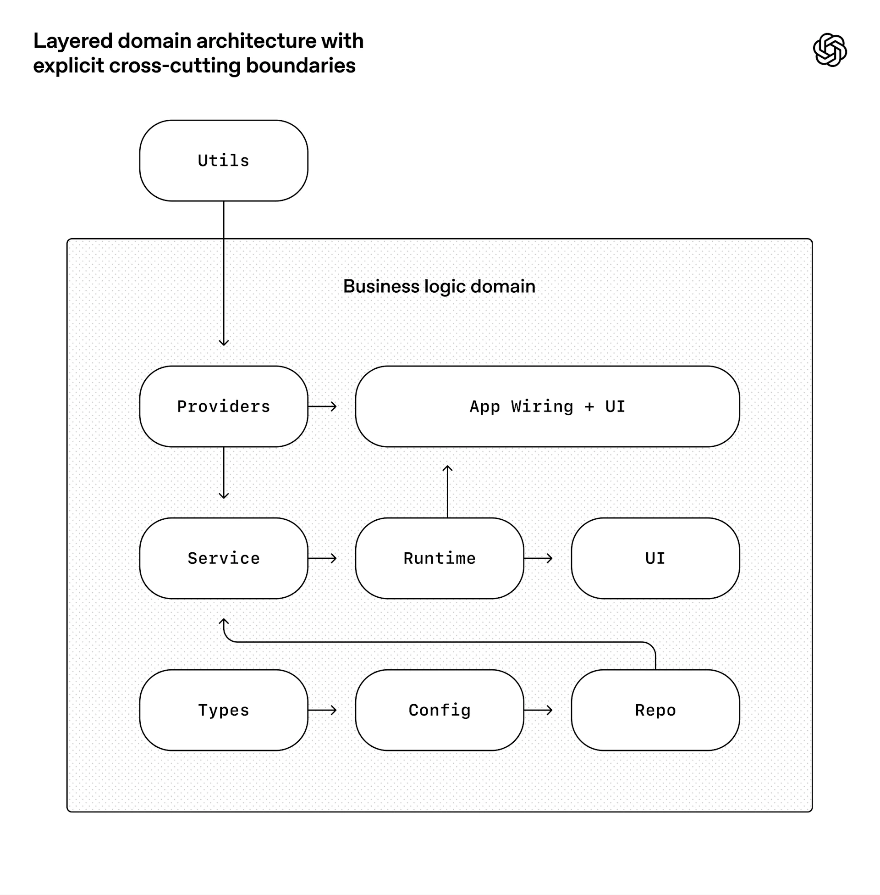
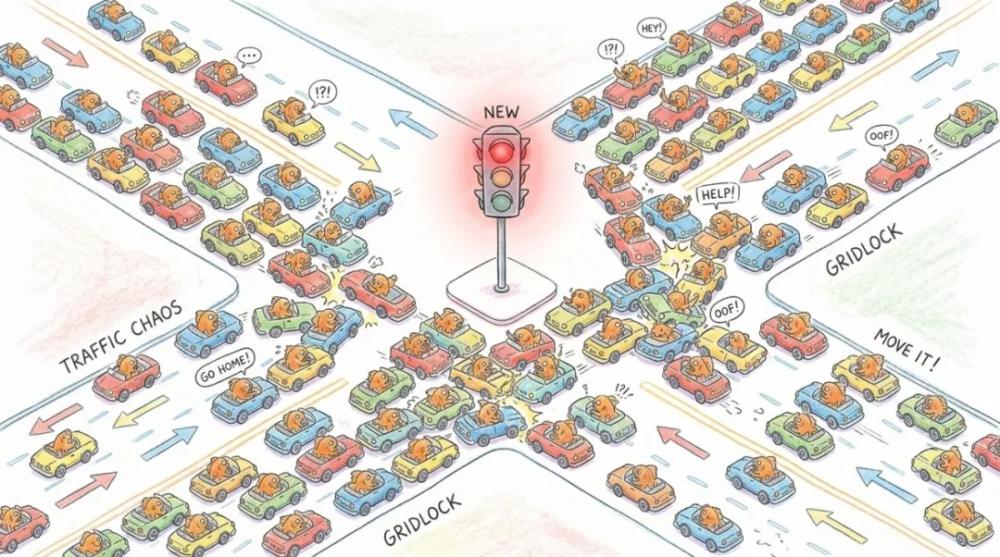
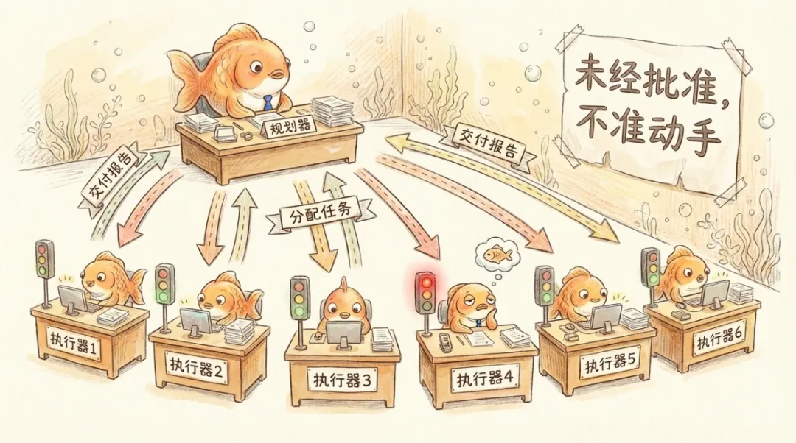

<!-- page layout=cover -->
<!-- title -->
# Harness Engineering 驾驭工程

<!-- author -->
**马宁**

<!-- date -->
**2026年4月**

<!-- page layout=plain -->
<!-- title -->
## 什么是 Harness Engineering

> **Agent = Model + Harness**

把 Agent 想成一辆车

- 模型是引擎；聊天框和提示词像方向盘和轮子，但引擎加方向盘不等于车
- 你还需要变速箱、刹车、仪表盘
- 凡是不是模型权重本身、却又决定模型怎么接世界、怎么持久化、怎么拿反馈的东西，都算 Harness 的一部分。

[1] *LangChain, The Anatomy of an Agent Harness*

同一款模型，换一套 Harness 外壳，表现可以差很多

- 今年 3 月，LangChain 发布了一篇题为 The Anatomy of an Agent Harness 的实证文章，他们在这份报告里引用了一个实验数据对比。仅仅是给同一个大语言模型换上一套更精巧的 Harness 架构，它在 Terminal Bench 2.0（一个专门衡量 AI 编程能力的权威榜单）上的排名，直接从 30 开外提升到第 5 名。
<!-- page layout=plain -->
<!-- title -->
## 我们把 Coding Agent 想象成一条金鱼


<!-- page layout=two-column -->
<!-- title -->
## 演进三部曲：从 Prompt Engineering 到 Context Engineering 再到 Harness Engineering

<!-- left -->
- **Prompt Engineering 提示词工程**：主要研究提示词怎么写得好——适合单轮、短任务。
- 金鱼的记忆只有 7 秒，所以我们要给 Agent 准备个笔记本，短记忆……长记忆……
- **Context Engineering 上下文工程**：把问题升级成这一轮采样前，到底往笔记本（上下文）里塞什么：系统提示、工具说明、检索结果、历史对话……
- **Context Engineering 带来新的问题**：上下文撑爆，上下文腐烂（Context Rot）。于是我们要为金鱼精心设计笔记本
- **上下文腐烂**：上下文越堆越长，模型反而越看不清重点、越干越蠢的现象。本质的原因是注意力涣散。
<!-- right -->

<!-- page layout=plain -->
<!-- title -->
## 给金鱼的记事本怎么准备

改变上下文的写入方式：

- 首先是 System Prompt，它不应该是写一段话就完了，而是要当成代码来维护，要进行版本控制、A/B 测试、按任务类型动态拼装不同的 prompt 模块。
- System 的两段拼装：上半部分是第一性原则，企业级 / 团队级 / 项目级要求；下半部分模块级 / 场景级要求。
- 不要把所有指导文件都塞到 System Prompt，拆解到子目录引用。
- 改变工具描述，工具描述不清既低效又占上下文。工具的命名、参数说明、返回值格式，都直接影响 Agent 的决策质量。
<!-- page layout=two-column -->
<!-- title -->
## 上下文的压缩与淘汰

<!-- left -->
- 模型的 Context Window 焦虑问题
- 太长的上下文导致 Context Rot
- 上下文压缩的几种模式：clear / compact / rewind / subagent
- **Clear**：噪声太多，代码推翻重来，反正 token 很便宜……；
- **Compact**：延续当前对话，但历史太长了，让模型自己做摘要提炼；
- **Rewind**：发现走错了路径，直接回退到历史，同时清理掉错误路径的记忆；
- **Subagent**：独立的事件不要污染当前上下文，master 只关注结果不关注过程。
<!-- right -->

<!-- page layout=plain -->
<!-- title -->
## 光有记事本不够

刚才说的都是 Prompt Engineering 到 Context Engineering 的方法论，但只做 Context Engineering，Agent 一样会搞得一团糟：

- Context Engineering 这个围绕记事本的方案解决的只是存不住的问题。
- 但金鱼的毛病远不止存不住。它有时候不翻本子，翻了经常压根不按本子上写的去做。
- 做完了还盲目自信，缺乏自我验证的能力。

记事本不是问题。没人逼金鱼翻它照做、没人验证金鱼写的是不是真的，才是问题。

这个认知的跃迁，让我们的应对方式从做一个更好的记事本彻底转向了围绕严格遵守工作流程，构筑一整套管理制度，这就是 **Harness Engineering**。
<!-- page layout=plain -->
<!-- title -->
## 四种失败模式

1. **提前交卷**：Agent 做了三个功能就宣布「项目完成」，它看到已有的代码量，以为活儿干完了。
2. **环境盲区**：Agent 真的在写代码，但环境有 Bug，它写的东西跑不起来，它自己不知道。它不看 Log，不去试着访问 UI。
3. **虚标完成**：功能清单上标了 done，但实际功能是坏的。Agent 改完代码跑了单元测试，以为没问题，其实端到端根本跑不通。甚至 Agent 会报告「我在这里填了个 todo 占位符」就宣布工作完成。
4. **失忆实习生综合征**：每一轮新会话都花大量 Token 重新摸索项目结构，像是一个新来的实习生反复问「代码在哪个文件夹」。
<!-- page layout=two-column -->
<!-- title -->
## 解决虚标完成与提前交卷

<!-- left -->
[1] *Anthropic, Effective harnesses for long-running agents*

- Anthropic 意识到不能光靠记忆系统和 Markdown 格式的外部化。
- 不能让 Agent 既当运动员，又当裁判。
- 在项目开始时，由一个专门的初始化 Agent 生成一份完整的功能清单，这个用的是 JSON 结构。
- 它被设计成真正干活儿的编码 Agent 只能改一个字段标「"passes": true」或「"passes": false」的严格死流程。
- Agent 不能删功能，不能改描述，只能标状态。而且规定 Agent 必须在自己实际测试通过之后才能把状态改成 PASSED，不能光凭看起来差不多了就标完成。

  
使用 JSON 成了防作弊的物理锁，通过强校验这段数据卡住进度。而 Markdown 格式的文件依然存在，但主要用于提供路标，而不是严格流程。
<!-- right -->
```json
{
    "category": "functional",
    "description": "New chat button creates a fresh conversation",
    "steps": [
      "Navigate to main interface",
      "Click the 'New Chat' button",
      "Verify a new conversation is created",
      "Check that chat area shows welcome state",
      "Verify conversation appears in sidebar"
    ],
    "passes": false
  }
```
<!-- page layout=two-column -->
<!-- title -->
## 解决失忆实习生综合征

<!-- left -->
针对失忆实习生，每个 Session 开头强制执行唤醒仪式：

1. 跑 pwd（确认当前目录），对齐 repo 根目录
2. 读 git log（查看代码改动历史）
3. 读 progress.txt（查看下一个任务）


像工厂换班时，下一班工人先翻交接簿。Agent 的记忆不存在于它自己脑子里，而存在于 Git 历史和进度文件里。

Anthropic 还加了一层更硬的保险。每一次代码改动都通过 Git 存档。一旦模型陷入死胡同，直接用 git revert 把代码库回滚到上一个能跑的干净状态，然后重新唤醒模型。

> **不要指望金鱼自己撤销错误，直接给它一台时间机器。**
<!-- right -->

<!-- page layout=two-column -->
<!-- title -->
## 有了可靠的重启动，有时候可以直接换一条金鱼

<!-- left -->
当历史消息临近撑爆上下文窗口时，Anthropic 建议有时候可以直接重启会话（Context Reset），因为：

- 有了上述解决失忆实习生综合征的可靠方法
- 压缩依然可能带着污染的上下文
- 彻底给金鱼一张白纸，让它集中注意力，重新开始
<!-- right -->

<!-- page layout=two-column -->
<!-- title -->
## 仓库即现实（Repo-as-truth）

<!-- left -->
[1] *OpenAI: Harness engineering: leveraging Codex in an agent-first world*

从 Agent 的角度看：

- 能直接访问的只有：代码、仓库内的文档、配置和测试；任何存在于聊天、脑海、会议纪要里的信息，对它都是「不可见的」。
- 如果「真实需求」和「仓库里的描述」不一致，Agent 就会不断犯「失忆实习生综合征」的错。

这意味着，如果你想让 Agent 知道一件事，只有一个办法，即写进仓库：

- 架构决策要写进去
- 设计原则要写进去
- 质量标准要写进去
- 连「团队偏好什么风格」这种品味判断，都要写进去
<!-- right -->

<!-- page layout=two-column -->
<!-- title -->
## 仓库如何设计

<!-- left -->
AGENTS.md

- 一份写给 Agent 的「新员工手册」只有大约一百行，不是百科全书，是一份目录
- 它只告诉 Agent 去哪里找更深的信息——架构文档在哪、设计原则在哪、当前执行计划在哪


把知识分层到 `docs/` 里：

- **Execution plans**：存放复杂工作的执行计划，含进度和决策记录
- **Active plans / Completed plans**：区分未完成与已完成计划，放在同一文档体系中
- **Technical-debt tracker**：专门记录技术债，用文件形式存在 repo 里
- **Quality document**：给每个产品域和架构层一个评分，跟踪随时间的变化

文档也不是写完就扔在那里。OpenAI 专门跑了一个 Doc-gardening Agent（文档园丁，专职维护文档的 Agent）：

- 什么业务代码都不写，每天在仓库里巡逻。
- 一旦扫到某篇文档和真实代码脱节了，它就自动发起修改请求，把过时段落无情修剪掉。

> **过期的记忆比没有记忆更危险：金鱼读到错误的历史，产出的就是幻觉。**
<!-- right -->
```text
AGENTS.md
ARCHITECTURE.md
docs/
├── design-docs/
│   ├── index.md
│   ├── core-beliefs.md
│   └── ...
├── exec-plans/
│   ├── active/
│   ├── completed/
│   └── tech-debt-tracker.md
├── generated/
│   └── db-schema.md
├── product-specs/
│   ├── index.md
│   ├── new-user-onboarding.md
│   └── ...
├── references/
│   ├── design-system-reference-llms.txt
│   ├── nixpacks-llms.txt
│   ├── uv-llms.txt
│   └── ...
├── DESIGN.md
├── FRONTEND.md
├── PLANS.md
├── PRODUCT_SENSE.md
├── QUALITY_SCORE.md
├── RELIABILITY.md
└── SECURITY.md
```
<!-- page layout=two-column -->
<!-- title -->
## Linter + CI 自反馈循环

<!-- left -->
所有「你真的在意」且可以静态检测的约束，都要优先变成 Linter / CI

- 关键规则必须变成可执行的自动化检查，custom linter 规则、结构化测试，挂在 CI 流水线上，违反了就合并不进去
- Agent 不需要「记住」规则，它只需要根据报错信息改到通过为止（Ralph Wiggum Loop）
- 每条 Linter 报错都应该包含三要素——问题是什么、怎么修、去哪看文档

> Agent 写代码 → Linter 检查 → 发现违规 → 错误消息包含修复指引 → Agent 读取指引 → 修复代码 → 再次检查 → 通过


Codex 的仓库：

- 每个业务域内部有固定层次（Types → Config → Repo → Service → Runtime → UI），层间依赖方向只允许「向前」，通过自定义 Linter 与结构测试强制执行。
<!-- right -->

<!-- page layout=two-column -->
<!-- title -->
## Linter 不是万能的：Agent 的盲目自信

<!-- left -->
[1] *Anthropic: Harness design for long-running application development*

- 强制测试能抓住的是功能性错误，这个函数输入 X 应该输出 Y。
- 用 Linter 当质量把关，但 Linter 能抓住的是结构性违规，比如依赖方向反了、命名不规范、文件太大。
- 有一大类问题这两种设置都抓不住：比如页面打开了但布局完全错位；功能在技术上「通过」了，但用户体验很差；代码逻辑自洽但业务需求理解偏差。
- 大语言模型有一个致命缺陷：当它评估自己刚刚完成的工作时，它几乎总是「自信地赞美」。
- 哪怕在人类观察者看来质量明显平庸。甚至在有明确对错的可验证任务中，它也时不时展现出糟糕的判断力。
- 它不是在骗人，它是真的觉得自己做得很好。
<!-- right -->

<!-- page layout=plain -->
<!-- title -->
## 打破盲目自信

Anthropic 的做法是把 Agent 作为 Evaluator（评估器）直接拉进 Harness 的内部循环：

- 灵感来自 GAN（生成对抗网络），把做事的和评判的分开。
- 但评估者本身也是一个 LLM，天然倾向于对 LLM 生成的输出「手下留情」。于是他们反复校准评估者，让它保持怀疑态度。校准后的评估者会亲自动手验货：打开浏览器、点击页面按钮、验证报错栈、截取屏幕画面。
- 像真实用户一样操作一遍，把最真实的端到端报错状态扔回给 Generator（生成器），形成死磕的对抗循环。
<!-- page layout=plain -->
<!-- title -->
## 冲刺合同（Sprint Contract）

[1] *Anthropic: Harness design for long-running application development*

Anthropic 采取了更激进的做法

- 每轮迭代开工前，Generator 和 Evaluator 先协商做完长什么样。像甲方和乙方开工前先签验收标准
- 不是人类定的标准，是两个 Agent 自己谈出来的验收条件

[2] *Cursor: Building a better Bugbot*

Cursor 的做法是搞出了一个 8 通道并行盲审机制：

- 对于同一个代码差异，壳内控制系统会拉起 8 个独立的 Bugbot
- 每个通道拿到的 Diff 代码被打乱了顺序，顺序不同，推理路径就不同，幻觉就不容易同步
- 8 个通道各自独立发现 Bug，最后用多数投票合并
- 合并后的结果还要再过一遍验证器模型，捕捉残留的误报
<!-- page layout=two-column -->
<!-- title -->
## 多 Agents 的无政府状态

<!-- left -->
[1] *Cursor: Scaling long-running autonomous coding*


Cursor 团队尝试让几百个 Agent 共享一份大型项目。结果，20 个 Agent 同时工作，有效吞吐量下降到仅相当于 2～3 个 Agent 在跑：

- 锁机制变成了瓶颈，大家互相等待，谁也推进不了。
- 其余的 Agent 发现核心代码被占用了，为了显示自己还在工作，就专门挑最简单、最无关紧要的代码去改：整个代码库被疯狂修改注释、调整空格和缩进格式。
<!-- right -->

<!-- page layout=two-column -->
<!-- title -->
## 如何管理多 Agents

<!-- left -->
Anthropic 在多篇工程文和中文综述里，把多 Agent 架构做成 协调者（Coordinator） + 执行者（Workers） + 评估者（Evaluators）：

- **Coordinator / 主 Agent**：负责理解需求、拆分任务、选择子 Agent、合并结果
- **Worker / 专业 Agent**：负责某一类重任务（代码实现、Bash 执行、代码库探索等），在自己的上下文里深入工作
- **Evaluator / 评判 Agent**：专门负责验证（跑测试、检查安全性、打 PASS/PARTIAL/FAIL）

几个核心原则：

- Agent 角色定义要写清楚「做什么、不做什么」
- Master-agent 轻，Sub-agents 重：Master-agent 保持干净上下文，只看目标、计划和 Sub-agents 的摘要结果；Sub-agents 在自己的会话中做大量工具调用、检索、代码阅读，最后只返回 1–2k token 的浓缩
- Sub‑agents 真正的用处是 上下文隔离，而不是「前端工程师 Agent / 后端工程师 Agent」这种人格标签
<!-- right -->

<!-- page layout=plain -->
<!-- title -->
## Harness 是移动的框架

在 2025 年 11 月第一篇 Harness 文章 Anthropic: Effective harnesses for long-running agents 诞生后，Opus 4.5 和 4.6 相继登场。Anthropic 开始拆自己造的东西：

- **Context Reset（上下文重置）**拆了。Opus 4.6 的上下文管理能力已经强到不再需要那块干净画板。加上它跑和不加它跑，产出质量没有区别，反而多了一层编排成本。
- **Sprint Contract（冲刺合同）**拆了。新模型已经能自己把控节奏，不再需要 Evaluator 和 Generator 每轮开工前先谈一份验收合同。合同流程还在，Evaluator 从每轮对抗改成了最后一轮做 QA（质量验收）。不是不需要了，是需要的方式变了。
<!-- page layout=plain -->
<!-- title -->
## 对 Harness 的重新认知

> **Harness 的每一个组件，都编码了一条关于模型做不到什么的假设。**

当假设不再成立，组件就该挪走了。

难的不是拆本身，是判断什么时候该拆：

- 拆早了，模型还撑不住，系统会塌；
- 拆晚了，多余的补偿层遮挡模型的真实能力，你以为 Harness 在帮忙，其实在碍事。

Takeaways：

- Harness 里每个维度存在的理由都不是「它能做什么」，而是「模型做不到什么」。
- 值得尝试的 harness 组合空间没有随模型进步而缩小，它在移动。
- 真正有价值的不是补偿的厚度，是追踪补偿面迁移的能力，知道下一寸该加什么，上一寸该拆什么。
<!-- page layout=two-column -->
<!-- title -->
## 结语：Coding Agent 带来的人类工程师角色变化
<!-- left -->
- **设计环境与约束，而不是写具体代码**  
    负责设计仓库结构、工具链、Linter / CI、沙箱和 Hooks，把「能做什么、不能做什么」编码进环境，让 Agent 在其中安全高效地写代码。
- **表达意图与任务分解，而不是亲自实现**  
    把业务需求拆成清晰的任务、feature list 和验收标准（plans、进度/状态文件），用自然语言和结构化文件告诉 Agent 做什么、做到什么程度算完成。
- **沉淀知识并维护「仓库即现实」**  
    持续把架构决策、规范、技术债、质量标准写入并维护在仓库文档和配置中，保证这些内容对 Agent 始终是最新、可发现、可验证的事实基底。
<!-- right -->
- **把经验和「品味」机械化为规则**  
    将反复出现的 Review 意见、最佳实践和安全/架构约束，转化为自定义 Linter 规则、结构测试和自动化检查，让 Agent 按这些规则自我修正，而不是靠人工反复提醒。
- **治理与裁判：观察 Agent 行为并迭代 Harness**  
    监控 Agent 的失败模式和「AI slop（AI 生成的低质量垃圾）」，分析根因，更新环境（文档、规则、Hooks、编排逻辑），只在需要人类判断时介入评估结果和产品方向，从而让整支 Coding Agent 团队越跑越稳。

<!-- page layout=two-column -->
<!-- title -->
## 如果你想实践一下...
<!-- left -->
用任何一个 AI Coding 工具，实现一个 md 转 html 幻灯的脚本，实现：

- 对 md 非侵入，不影响 md 本身的浏览 
- 多种页面布局（首页，尾页，目录页，章节页，普通页，双栏页，...）
- 容器的大小控制，容器与文字的对齐方式 left | center | right 
- 处理内容太长超出页面范围
- 嵌入代码，嵌入图片，mermaid 渲染
- 多种 themes 支持，参考 html-ppt 目录提供的 themes


<!-- right -->
<https://github.com/ryanma9629/harness>


<!-- page layout=two-column -->
<!-- title -->
## 参考文献

<!-- left -->
1. LangChain, The Anatomy of an Agent Harness, <https://www.langchain.com/blog/the-anatomy-of-an-agent-harness>, Mar-2026
2. LangChain, Improving Deep Agents with harness engineering, <https://www.langchain.com/blog/improving-deep-agents-with-harness-engineering>, Feb-2026
3. OpenAI, Unrolling the Codex agent loop, <https://openai.com/index/unrolling-the-codex-agent-loop/>, Jan-2026
4. OpenAI, Harness engineering: leveraging Codex in an agent-first world, <https://openai.com/index/harness-engineering/>, Feb-2026
5. Anthropic, Effective context engineering for AI agents, <https://www.anthropic.com/engineering/effective-context-engineering-for-ai-agents>, Sep-2025
6. Anthropic, Effective harnesses for long-running agents, <https://www.anthropic.com/engineering/effective-harnesses-for-long-running-agents>, Nov-2025
<!-- right -->
7. Anthropic, Harness design for long-running application development, <https://www.anthropic.com/engineering/harness-design-long-running-apps>, Mar-2026
8. Cursor, Building a better Bugbot, <https://cursor.com/blog/building-bugbot>, Jan-2026
9. Humanlayer, Skill Issue: Harness Engineering for Coding Agents, <https://www.humanlayer.dev/blog/skill-issue-harness-engineering-for-coding-agents>, Mar-2026
10. 腾讯科技, 一文读懂 Harness Engineering：从14篇工程文章中，寻找那个让 AI 不再离经叛道的壳, <https://mp.weixin.qq.com/s/DE0hc3Mz6zwoSCgL0k4SgQ>, Apr-2026
